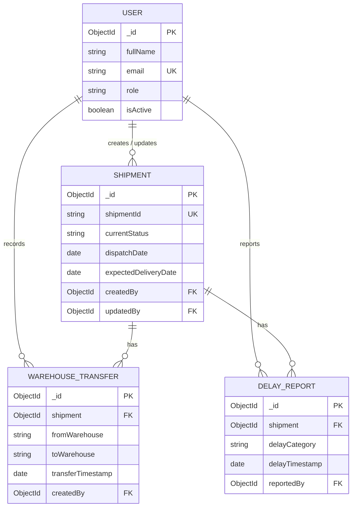

# L-DAD database design

L-DAD uses four MongoDB collections. `Shipment` stores the current operational
state for fast dashboard reads; transfers and delays are append-only operational
events that reference the shipment. This prevents an ever-growing shipment
document while preserving complete history.

## Entity relationship diagram



## Collections and relationships

| Collection | Purpose | References |
| --- | --- | --- |
| `users` | Authentication and operational accountability. | None. |
| `shipments` | One document per shipment and its current state. | `createdBy`, `updatedBy` -> `users._id`. |
| `warehousetransfers` | Transfer history; many records per shipment. | `shipment` -> `shipments._id`; `createdBy` -> `users._id`. |
| `delayreports` | Delay history and analytics events; many records per shipment. | `shipment` -> `shipments._id`; `reportedBy` -> `users._id`. |

MongoDB references are not foreign-key constraints. The application must verify
referenced records and decide how to handle related history before deleting a
user or shipment. In normal operation, deactivate users with `isActive` instead
of deleting them.

## Schema rules

All schemas use `timestamps: true`, producing `createdAt` and `updatedAt`, and
disable the Mongoose version key. ObjectId fields use named `ref` values so
queries can use `populate` when a view needs user or shipment details.

- **User:** `email` is normalized to lowercase and is uniquely indexed. Password
  is expected to be a hash, is hidden by default (`select: false`), and is
  removed from JSON output. Roles are `Manager`, `Analyst`, and `Coordinator`.
- **Shipment:** `shipmentId` is an uppercase unique business key. Status is one
  of `Dispatched`, `In Transit`, `At Warehouse`, `Delayed`, or `Delivered`.
  Expected and actual delivery dates cannot precede dispatch; delivered records
  must include an actual delivery date.
- **WarehouseTransfer:** source and destination warehouse names are required and
  compared case-insensitively, so a transfer cannot have the same source and
  destination. The event time defaults to creation time.
- **DelayReport:** structured categories (`Weather`, `Vehicle Issue`,
  `Warehouse Delay`, `Customs`, `Traffic`, and `Other`) make aggregation stable;
  a separately required reason retains the operational context.

## Index strategy

| Collection | Index | Primary query |
| --- | --- | --- |
| `users` | `{ email: 1 }` unique | Login / account lookup. |
| `shipments` | `{ shipmentId: 1 }` unique | Shipment lookup by business ID. |
| `shipments` | `{ currentStatus: 1, expectedDeliveryDate: 1 }` | Status and due-date dashboard worklists. |
| `shipments` | `{ origin: 1, destination: 1 }` | Route views and aggregates. |
| `warehousetransfers` | `{ shipment: 1, transferTimestamp: -1 }` | A shipment's newest transfer events. |
| `warehousetransfers` | `{ fromWarehouse: 1, toWarehouse: 1, transferTimestamp: -1 }` | Warehouse-pair reporting. |
| `delayreports` | `{ shipment: 1, delayTimestamp: -1 }` | A shipment's newest delay events. |
| `delayreports` | `{ delayCategory: 1, delayTimestamp: -1 }` | Category analytics. |
| `delayreports` | `{ reportedBy: 1, delayTimestamp: -1 }` | User audit views. |

Deploy indexes before production traffic and convert duplicate-key error `E11000`
into a clear API response. For update queries, use `{ runValidators: true }`.
The date and delivery-state rules are most reliable when changes are made using
document `save()`.

## Suggested server layout

The implementation follows a domain-first equivalent of `server/models`; each
module owns its model, while `server/src/models/index.js` is a single import
point for application bootstrap code.

```text
server/src/
  constants/logistics.constants.js
  models/index.js
  modules/
    auth/models/User.js
    shipments/models/Shipment.js
    warehouse-transfers/models/WarehouseTransfer.js
    delay-reports/models/DelayReport.js
```
